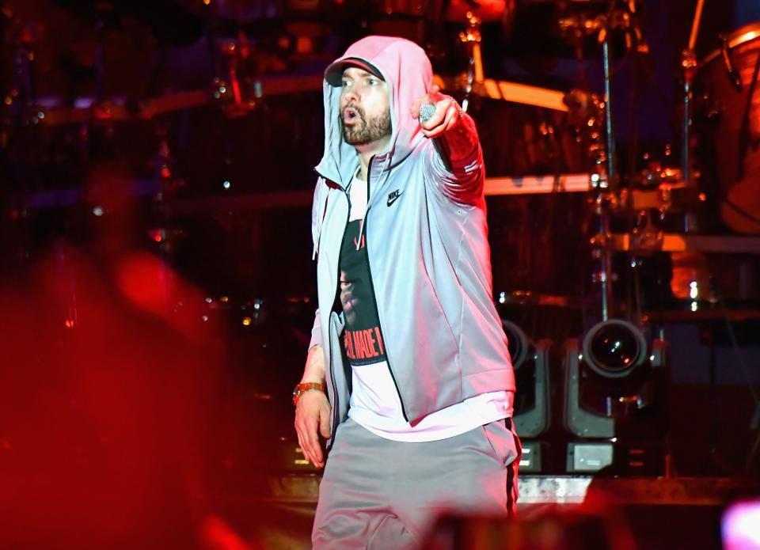
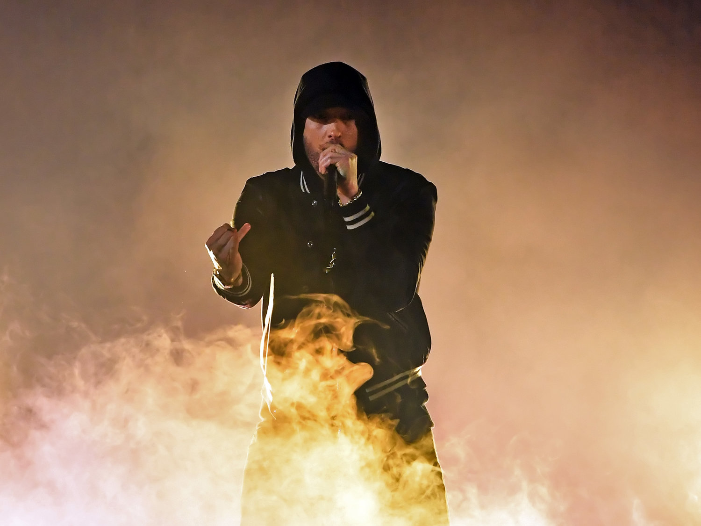

Short answer

It’s way, way, way better than Revival. While not a perfect album, Kamikaze accomplishes everything Eminem wanted it to, sticking it to those who unfairly hated on Revival and proving he’s still got it.

Long answer

Alright, let’s get one thing out of the way: Revival was a disaster. Whether you’re one of the few who liked it or the many who didn’t, we can all agree on that. It still went number-one on the Billboard 200, but the album mostly just pushed Eminem further into irrelevance. It divided critics and mostly disappointed fans; not since Encore and Relapse has Eminem dropped an album that got so much hate.

And that made Eminem really, really mad.

It’s impossible to talk about Kamikaze without talking about Revival, because, as Eminem notes more than once, this is his response to the people who said he fell off, who said he’s past his prime, who said he hasn’t got it anymore.

And…boy, did he ever bring it.

There are two ways to look at this album. If you’re looking for Eminem to go back to what he was doing on The Slim Shady LP and The Marshall Mathers LP, you will once again be disappointed. In fact, it should have been obvious to you since Recovery that Eminem would never make another album like those. He’s a different man now, a different artist, and has been for some time. Expecting another Mathers LP out of him is just setting yourself up for disappointment; if that’s what you want out of him, you won’t find it here.

However, if you’re looking for the return of the artist who brought you Rap God, and who delivered two killer verses on the Chloraseptic remix and on Royce da 5′9″’s Caterpillar, then man, oh man, you’re in for a treat.

This is an album full of bangers. The opening trio of tracks - The Ringer, Greatest and Lucky You - are pure, visceral lyricism, with a flow that makes the fast part on Rap God look tame by comparison. Not Alike - featuring old friend Royce da 5′9″ - is another standout, and another case where both men are simply delivering bar after bar of intense, highly witty lyricism.

Perhaps the best part of Kamikaze, though, is the welcome absence of Revival’s worst faults. Gone are the awful production, the stilted flow, the cheap pop choruses and the insufferable dad jokes that ruined Revival; in their place are (mostly) tight beats, and some of the most technically mind-blowing rap Eminem has ever made.

Of course, I said the album isn’t perfect, and it’s not. The song quality tails off a bit near the end, especially with Nice Guy - which is easily the worst song on the album - boasting an obnoxious hook and comparatively simple and unimaginative bars from Em. Hooks in general are a problem on Kamikaze; they’ve never been his strong suit, not even during his glory days, but here a lot of songs either don’t have much of a hook at all or they have a weak nothing of a hook that doesn’t do much more than kill time before the next verse.

Overall, though, Kamikaze shows Eminem has still got it. It won’t replace his classic albums anytime soon, but it’s probably the best album he’s capable of making at this point in his career. Let me put it this way: other than a few tracks, I personally wish Revival had never happened. Kamikaze, though, is a welcome addition to the Eminem discography.
