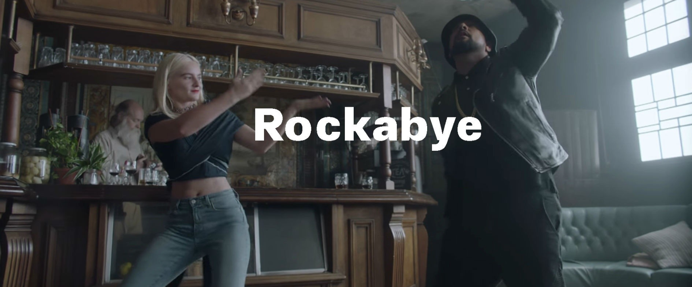

Some of the favorite tracks in my playlist currently are:

CLOSER - The Chainsmokers

With a tune as soft as this. The incredible vocals ably support the meaningful & subtle lyrics. The Chainsmokers , a US duo who are going at their all time high with yet another Billboard No.1 Hit! The song not only celebrates Youth but, Heart Break too!

Sample these lyrics:

“So baby pull me closer
In the backseat of your Rover
That I know you can't afford
Bite that tattoo on your shoulder
Pull the sheets right off the corner
Of the mattress that you stole
From your roommate back in Boulder
We ain't ever getting older”

I’m sure this is everyone’s current favorite!

Another song which I enjoy listening to: ‘StarBoy’ - The Weeknd ft. Daft Punk

An infectious song. This is a song about Weeknd’s realisation about his super stardom. The Weeknd has come a long way, but with negative consequences in his journey to the top, The Weeknd has developed mixed feelings towards fame. This song captures his mood about how he was ‘Earlier’ & how is he now after attaining this unprecedented stardom!

You could also listen to an energetic track released by Bruno Mars (musician) just a few days back. The song is called ‘24K Magic’ We get to see Bruno back to his initial days! Great song.

A beautiful song that explains a relationship shared by a Single Mother with her kid. What are the challenges she faces as a Single Mother, wonderfully explored by ‘Clean Bandit’ feat Sean Paul, Anne-Marie.

Probably, in a long time, Sean Paul’s vocals doesn’t ruin the song! :P

Here are a few more songs that you might enjoy:

* Scared to Be Lonely - Martin Garrix ft. Dua Lipa (Garrix’s latest track!)
* Cold Water - Major Lazer ft. Justin Beiber, MO
* Let Me Love you - DJ Snake ft. Justin Beiber
* In The Name Of Love - Martin Garrix ft. Bebe Rexha
* Heathens,Ride,Stressed Out - Twenty One Pilots
* Treat You Better - Shawn Mendes
* We Don’t Talk Anymore - Charlie Puth ft. Selena Gomez
