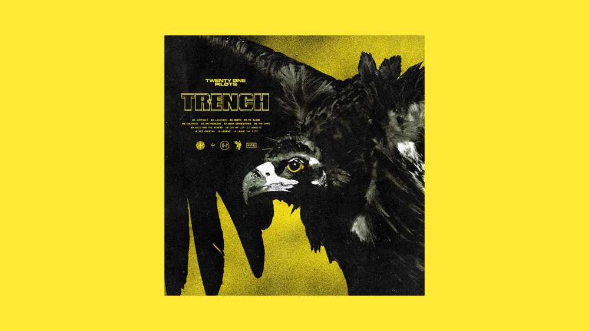

I pretty much love every song. And by love I mean, I cry, I scream, I laugh, I smile. TOP songs give you major feels. They awaken every bone and emotion in your body. I can only listen to TOP for months and never once listen to anything else. The love is a real with Twenty One Pilots and their fans; a true "attached at the hip" kind of love story.

I will say however, my least favorite album is "Blurry Face." It has great beats for sure! But it's missing some of the rawness that TOP brings with their earlier music. I feel BlurryFace is more poppy and generic (although still amazing!) than their original stuff like Regional at Best, Twenty One Pilots and Vessel. My favorite album by far is Vessel. Wow. 
EVERYTHING THEY MAKE IS GOLD. 

What I do love about Blurryface though is the concept of it. How TOP personifies their  insecurities and fears through this character Blurryface. And how Tyler brings incredible brilliant symbolism to his work in this album, such as his blackened hands and throat to symbolize his insecurities.  He is nothing short of brilliant.

And their interviews?? Forget about it! They are SO funny! When asked about how they met, they will always without hesitation make up a story on the spot. It is hilarious and ingenious. Josh is so witty and clever in his comebacks and retorts to Tyler and interviewees. And Tyler's philosophical answers to questions will always leave you wanting more. 

I should mention briefly how Josh and Tyler treat people. They are genuinely good people who stand behind honest music and being truthful with their fans. In their interviews they won't be "artsy" or "elusive", they will give you solid answers about themselves and about their music. They give it all away, no BS. Even their music videos star their families and Tyler's wife; not hired and paid actresses. The song Stressed Out was filmed in the very houses and bedrooms they grew up in. Tyler's brother Zack cameo's in the music video as well. Everything to the bone of what they do screams pure honesty and pure art from the heart. They want you to trust them. They want you to feel like they are your friends. And you do. Other artists in the industry should take note and take lead. 
This is what we want; truth in art again. This is what TOP brings to the table. They are revolutionary.

The lyrics are perfect and brilliant. Not many cliche statements. Tyler writes songs and lines that make you think and that make sense. His lyrics make you feel like he understands you better than anyone else. His lyrics perfectly transcend your emotions. His words are honest and smart. And the music in his songs?!?! How does he think of such amazing sounds and beats and chords and ahhhh!?!?!  HOW????

My favorite songs change depending on my state of mind and current emotions and experiences in life.

Right now I'm loving the song "Holding onto You."

I also love the songs

"Car Radio"
"Migraine"
'Trees"
"Goner"
"Guns for Hands"
"Semi-Automatic"
"Ode to Sleep"
"Doubt"
"Hometown"
"Drown"
"Blasphemy"
"Kitchen Sink"
"Taken By Sleep"
"Friend, Please"
"Save"
"Whisper"
"March to the Sea"

Ok. I love every song.
This is the best band I have ever heard in my life. And I KNOW good music. And the thing is, you do fall in love with the music but more importantly, once you get to really know Tyler and Josh, you fall in love with them. You not only love their music, you love the  two who produce it and it's this surreal magical experience.
