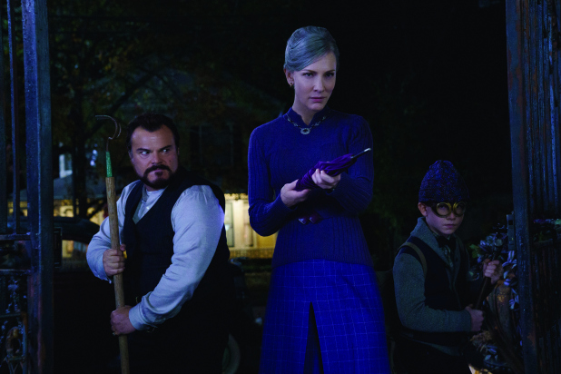
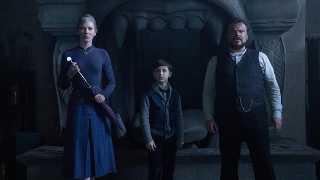

“The House With a Clock in Its Walls” is the story of Lewis Barnavelt (Owen Vaccaro, “Daddy’s Home 2”), a young orphan in 1953 who gets sent to live with his eccentric uncle, Jonathan (Jack Black), who lives in a giant spooky house filled from top to bottom, for some reason, with ticking clocks. Jonathan lives alone but always seems to have the same houseguest, Florence Zimmerman (Cate Blanchett), a purple-clad widow who has a plate full of cookies handy for Lewis to munch on at all times, and pointed insults to trade with Jonathan.

It doesn’t take long for Lewis to discover that his uncle’s house is haunted, and that Jonathan and Florence are, respectively, a real-life warlock and witch. But that’s not a problem, and this house is a haven for weirdos. At least, it has been ever since its previous owner Isaac Izard (Kyle MacLachlan) died and left a mysterious clock hidden somewhere within the walls, which has an unknown, sinister purpose, and which no one is able to find.

Eli Roth probably seems like a strange choice to direct a kids’ movie. He’s not the first horror filmmaker to make the transition, but films like “Cabin Fever,” “Hostel” and “The Green Inferno” are so astoundingly grotesque that adding a PG-rated adaptation of John Bellairs’ novel “The House With a Clock in Its Walls” to his résumé looks, at a glance, like some kind of prank.
