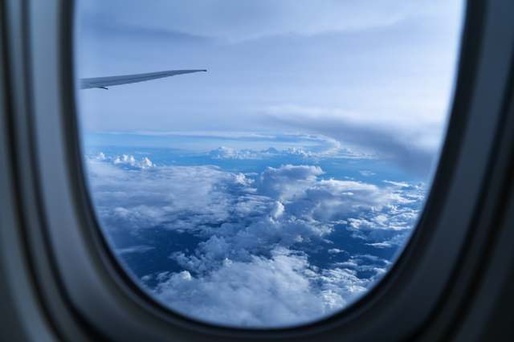

Of course, millions of people who do not speak French travel to France all of the time. Paris is a beautiful city, but like any big city lots of people live there and they have busy lives that they need to and want to live. So, they don’t have any extra time for tourists and they really don’t have any use for jerks.

So as a visitor, be polite, organize yourself for dealing with a foreign language. They have no expectation when visiting your country that you speak French. Please have no expectation that in their own country that they speak your language.

I have been to Paris a few times and I do not speak any French, but Bon Jour, Merci, si vous plait, oui and no. I have walked all over Paris and I dislike tourist areas so where I would wander did not see much in the way of tourists.

I would go into little shops and people were so kind and helpful even though we spoke no common language but politeness.

I have never had any interaction with a French citizen that was not pleasant. Except one really seedy hotel in a small town in the south of France. The owner was a dick, and a few people who did speak English explained to me after hearing the jerk complain that he was an jerk and everyone thought so. But honestly I love France and it is well worth experiencing what people have been saying for a 100 years, and that is Paris is a special city.

Also please remember that Paris, the metropolitan Paris holds 25% of France’s population. It is enormous. The way Paris is organized was to make it livable. So the city is designed to have many neighborhoods, rather than a choking city center. It is quite an achievement, especially for a city of its size.
