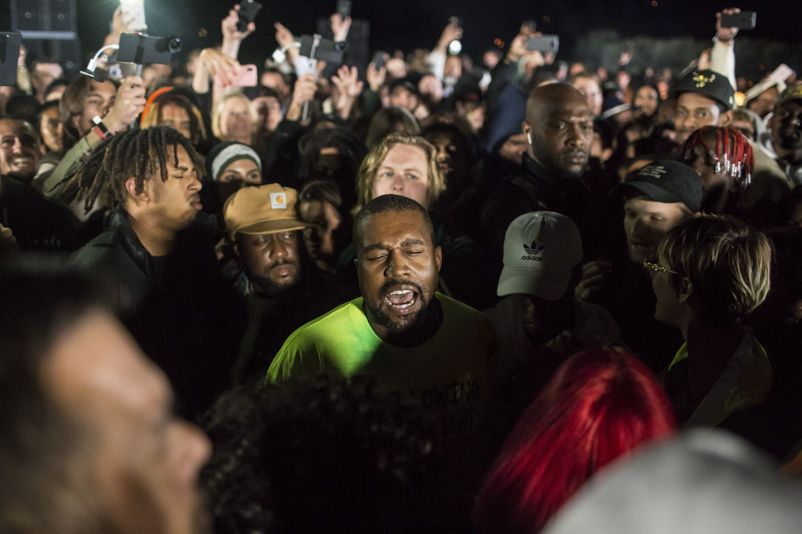
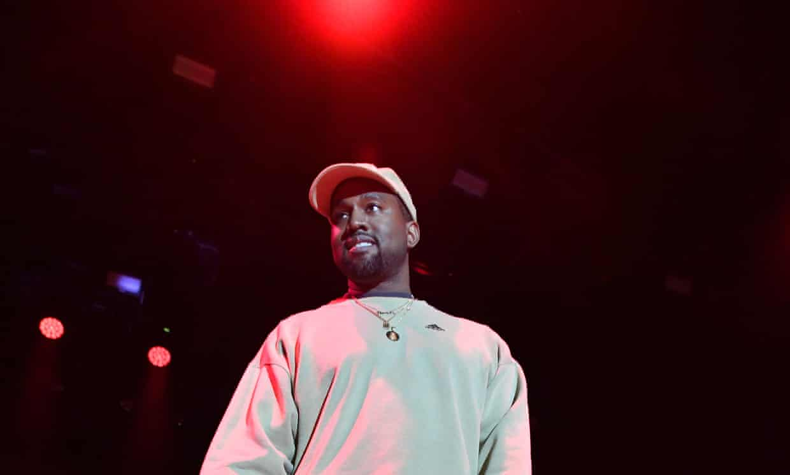

Its seven tracks – none of them an obvious hit single – clock in at a trim 23 minutes.

 Its cover was apparently snapped by West on his phone en route to the launch.
 
 
 
 But after his alienating support of Donald Trump and stunningly asinine recent musings on slavery, plenty of his longtime fans have been rather publicly pondering if the great Kanye compromise is still worth it.
 
 “Ye” is West’s shortest release
 
 but far from the return to form that might have helped heal his battered reputation,
 
  
 
 Unfortunately, the production is only one side of the coin, and West’s accompanying lyrics are among the weakest, and most unpleasant, that he’s ever committed to wax.
 
 It would be disingenuous to pretend that his evolution into a part-time MAGA hat model doesn’t affect the way this album is received, but West’s politics are only a symptom of a larger problem. What’s really the issue here is empathy, and the desperate degree to which West demands it of others while demonstrating a stark inability to return the favor.
